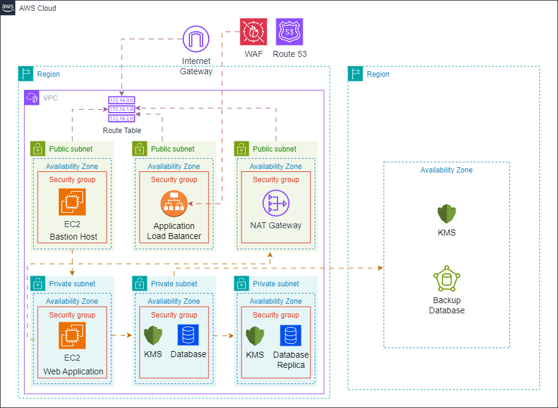

# Deploy de Aplicação Web Escalável e Segura na AWS com Terraform

Neste projeto, exploramos como utilizar o **Terraform** para orquestrar o deployment de uma aplicação web altamente escalável e segura na **Amazon Web Services (AWS)**. Aprenda a configurar bastion hosts para acesso seguro, implantar instâncias privadas para maior segurança e garantir alta disponibilidade com um banco de dados MySQL Multi-AZ.

---

- **Configuração de VPC (Virtual Private Cloud):**

  - Criação de subnets públicas e privadas para segmentação de rede.
  - Implementação de NAT Gateway para acesso seguro à internet em instâncias privadas.

- **Segurança e Acesso Seguro:**

  - Configuração de **Bastion Hosts** para acesso SSH seguro.
  - Implementação de **Security Groups** para controle de tráfego de entrada e saída.

- **Infraestrutura Escalável e Disponível:**

  - Deploy de instâncias EC2 privadas para maior segurança.
  - Uso de **Auto Scaling Groups** para escalabilidade automática.
  - **Application Load Balancer (ALB)** para balanceamento de carga eficiente.

- **Banco de Dados com Alta Disponibilidade:**

  - Configuração de **RDS MySQL Multi-AZ** para alta disponibilidade e failover.
  - Implementação de **Réplica de Leitura** para otimização de consultas.
  - **Backups Cross-Region** para recuperação de desastres.

- **Certificados SSL/TLS e HTTPS:**

  - Uso do **AWS Certificate Manager (ACM)** para gerenciar certificados SSL.
  - Configuração de HTTPS em **CloudFront CDN** para distribuição de conteúdo segura.

- **Infraestrutura como Código com Terraform:**
  - Criação e gerenciamento de infraestrutura como código (IaC) utilizando Terraform.
  - Modularização de componentes para reutilização e manutenção eficiente.
  - Integração com **GitHub Actions** ou **GitLab CI/CD** para automação de deploy.

## Pré-requisitos

- **Terraform v1.5.0+**
- **AWS CLI configurado**
- **Chave SSH** para acessar o Bastion Host
- **Domínio registrado no Route 53** (ex: `seu-dominio.com`)

---

## Arquitetura

A arquitetura provisionada segue o modelo de **Três Camadas (Three-Tier Architecture)**, conforme ilustrado abaixo:

---
